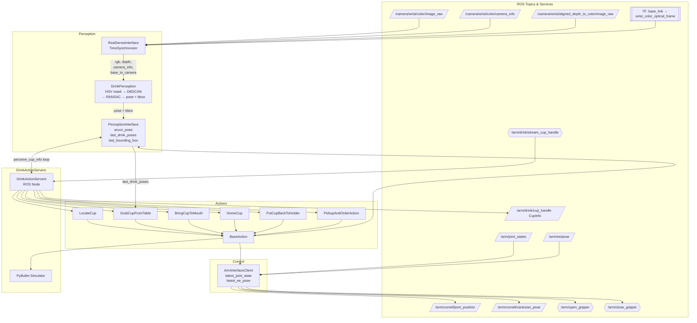

# RAMMP

## Requirements

- **OS:** Ubuntu 22.04  
- **Python:** 3.10+  
- **ROS 2:** Humble  

---

## Installation

### 1. Create and activate Conda environment

    conda create -n compute python=3.10
    conda activate compute

---

### 2. Create ROS 2 workspace and clone repository

    mkdir -p ~/ros2_ws/src
    cd ~/ros2_ws/src
    git clone https://github.com/empriselab/RAMMP
    cd RAMMP

---

### 3. Install RAMMP

    pip install -e ".[full]"

---

### 4. Install Pinocchio

    conda install -c conda-forge "pinocchio=3.1.*"

---

### 5. Configure environment variables

Add the following to your `~/.bashrc`:

    export LD_LIBRARY_PATH=/lib/x86_64-linux-gnu:/usr/lib/x86_64-linux-gnu:/lib:/usr/local/cuda-12.1/lib64:/opt/ros/noetic/lib:/opt/ros/noetic/lib/x86_64-linux-gnu
    export LD_PRELOAD="/lib/x86_64-linux-gnu/libffi.so.7 /lib/x86_64-linux-gnu/libtiff.so.5"

Then reload:

    source ~/.bashrc

---

### 6. Build ROS 2 workspace

    cd ~/ros2_ws
    colcon build
    source install/setup.bash

---

## Running

    ros2 launch drink_actions_test real.launch.py

---

## Head-perception calibration

Head perception tracks the user's head relative to a one-time calibration.
Run this once per user / camera setup before using `bring_cup_to_mouth`:

    python -m rammp.perception.head_perception.calibrate_head --tool drink

Position the user comfortably, hold the drink tip at their mouth, and press
Enter to capture. This writes the reference files to
`src/rammp/perception/head_perception/mediapipe_config/drink/`.

---

## Architecture

### Data Flow

### Key Components

| Component | File | Role |
|---|---|---|
| `DrinkActionServers` | `integration/drink_action_server.py` | ROS node hosting all action servers and the cup handle streaming service |
| `ArmInterfaceClient` | `control/robot_controller/arm_client.py` | Sends joint/cartesian commands to the arm; reads joint states and EE pose |
| `PerceptionInterface` | `interfaces/perception_interface.py` | Orchestrates perception; stores latest cup pose and derived grasp poses |
| `RealSenseInterface` | `interfaces/realsense_interface.py` | Subscribes to wrist camera topics; provides synced RGB+depth+camera_info and base-to-camera TF |
| `DrinkPerception` | `perception/drink_perception/drink_perception.py` | HSV color mask → DBSCAN clustering → RANSAC plane fit → 6-DOF cup pose + bounding box |
| `BaseAction` | `actions/base.py` | Base class for all HLAs; wraps arm commands and simulation |

### ROS Interfaces

**Action servers**

| Topic | Description |
|---|---|
| `/arm/drink/pickup_and_order` | Pick drink from wheelchair holder and move to handover pose |
| `/arm/drink/locate_cup` | Move arm to gaze position for cup detection |
| `/arm/drink/grab_cup_from_table` | Execute grasp sequence using last perceived cup poses |
| `/arm/drink/bring_cup_to_mouth` | Bring held cup to mouth pose |
| `/arm/drink/home_cup` | Move cup to home/staging position |
| `/arm/drink/put_cup_back_to_holder` | Return cup to wheelchair holder |

**Services**

| Topic | Description |
|---|---|
| `/arm/drink/stream_cup_handle` | `std_srvs/SetBool` — start/stop streaming cup pose on `/arm/drink/cup_handle` |

**Published topics**

| Topic | Type | Description |
|---|---|---|
| `/arm/drink/cup_handle` | `CupInfo` | Latest detected cup pose and bounding box |
| `/arm/cornell/joint_position` | `JointState` | Joint position commands to arm controller |
| `/arm/cornell/cartesian_pose` | `PoseStamped` | Cartesian EE pose commands to arm controller |

### Utilities

- **`integration/color_mask_tuner.py`** — Interactive OpenCV window with HSV trackbars for tuning cup detection. Prints final values to paste into `drink_perception.py`. Run with `python3 src/rammp/integration/color_mask_tuner.py`.
- **`integration/cup_handle_viz.py`** — Overlays the detected cup pose axes and bounding box onto the wrist camera image and publishes to `/arm/drink/cup_handle_viz` for RViz. Run with `python3 src/rammp/integration/cup_handle_viz.py`.
